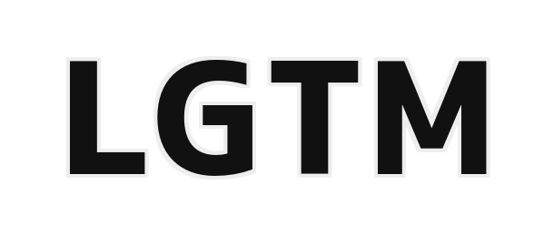
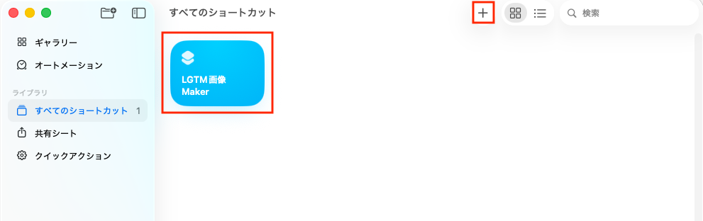

こんにちは、都内でエンジニアをしてるいりりんです。

皆さん、レビューをした時にLGTMを行うときに、LGTM画像（画像にLGTMという文字が入ったあれです）を添付することが多いと思います。

LGTM画像を作成する方法はいくつもありますが、私はよく「[LGTMOON](https://lgtmoon.herokuapp.com/)」をよく使っています。他にもLGTM画像を作成してくれるサービスはたくさんあります。

ただ、ローカルの画像を手軽にLGTM画像にできたら便利だなと思い、Gemini君に相談してみると「それは簡単にできるよ！」と言ってくれました。じゃあ作ってみよう！ということで、作ってみました。

# やってみる

## 作成するもの

今回作成するのは、Macでローカルの画像をLGTM画像に変換してくれるツールです。
（今回はMacの標準アプリである「ショットカット」を使います。）

## 事前準備

ツールを作成する前に、事前に以下のものが必要になります。

1. LGTM文字の画像

今回は以下のような画像を用意しました。

2. ローカル画像

今回は以下のような画像を用意しました。

## ショートカットAppでツールを作成する

### 1. 新規ショートカットを作成する

ショートカットAppの上部にある「＋」ボタンをクリックして、新規ショートカットを作成します。
作成した後、名前を「LGTM画像 Maker」とします。（ここは、自由に決めて大丈夫です。）

### 2. クイックアクションの設定

ローカル画像を右クリック>クイックアクションからツールを起動させたいので、右側のサイドバーにある「！」アイコンをクリックします。

そこで「クイックアクションとして使用」にチェックを入れます。

この時、「Finder」「サービスメニュー」にチェックが廃いていることを確認してください。

### 3. LGTM文字画像を取得する

### 4. 画像を重ねる

### 5. クリップボードに保存

### 6. ファイル名を生成

### 7. ファイルを保存

## 完成!!!

## まとめ

